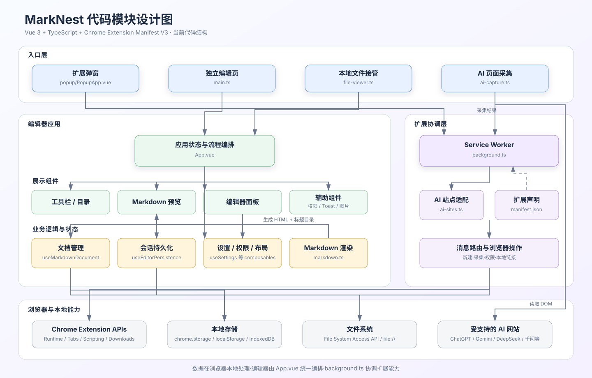

# MarkNest - 本地 Markdown 阅读与编辑器

MarkNest - 本地 Markdown 阅读与编辑器是一款基于 WXT、Vue 3、TypeScript、Pinia 与 `@webext-core/messaging` 构建的 Chrome / Edge Manifest V3 扩展，用于在浏览器中离线阅读、编辑和保存本地 Markdown 文件。

## 开发

环境要求：Node.js 22+，推荐使用 pnpm。

```bash
nvm use
pnpm install
pnpm dev
```

项目采用“WXT 入口 + Pinia 状态 + Vue 组件/composables”分层：

- `src/App.vue`：应用状态与业务流程编排。
- `src/entrypoints/`：WXT 背景脚本、弹窗、编辑页、本地文件和 AI 对话 content script 入口。
- `src/components/`：目录、预览、编辑器、权限引导、图片灯箱和 Toast 等组件。
- `src/composables/`：会话持久化、文件句柄、用户设置和提示状态。
- `src/stores/`：Pinia 共享状态，当前包含用户外观与编辑器布局设置。
- `src/messaging.ts`：`@webext-core/messaging` 类型化跨上下文通信协议。
- `src/markdown.ts`：Markdown、安全清洗与离线代码高亮。
- `wxt.config.ts`：Manifest V3、权限、域名和 WXT 模块配置。
- `.output/chrome-mv3/`：生产构建产物，可直接作为已解压扩展加载。

## 代码模块设计



## 构建与安装

```bash
pnpm build
```

然后打开 `chrome://extensions/` 或 `edge://extensions/`，启用开发者模式，选择“加载已解压的扩展程序”，加载项目的 `.output/chrome-mv3/` 目录。要接管本地 Markdown，还需在扩展详情页开启“允许访问文件网址”。

正式版会在未开启该权限时显示引导弹窗，并在工具栏图标上显示 `!` 徽标。开启权限并返回 MarkNest 后会自动重新检测。

生成可分发压缩包：

```bash
pnpm release
```

压缩包输出为 `.output/marknest-2.3.0-chrome.zip`。

## 使用

- 点击扩展图标打开快捷悬浮窗，可选择“新建编辑页”或“收录对话”。
- 在支持的 AI 当前对话页选择“收录对话”，确认 Markdown 文件的保存位置后，扩展会完成保存并在 MarkNest 中打开。
- 对话收录支持 ChatGPT、Gemini、DeepSeek、通义千问、Grok、豆包、Kimi 和智谱清言网页版。
- 直接在浏览器打开 `.md` 或 `.markdown` 文件，在原始 `file://` 地址中阅读和编辑。
- 支持目录与目录搜索、任务列表、表格、代码高亮和复制、图片大图预览、主题和字号设置、编辑器宽度调整、拖放打开与会话恢复。
- `Ctrl/Command + S` 保存源文件，`Ctrl/Command + Shift + S` 另存为。

所有 Markdown 内容均在浏览器本地处理，不会上传到网络。

“收录对话”仅在用户主动点击后读取当前受支持的 AI 对话标签页，并使用 `activeTab`、`scripting` 和 `downloads` 权限完成本地转换与保存。
